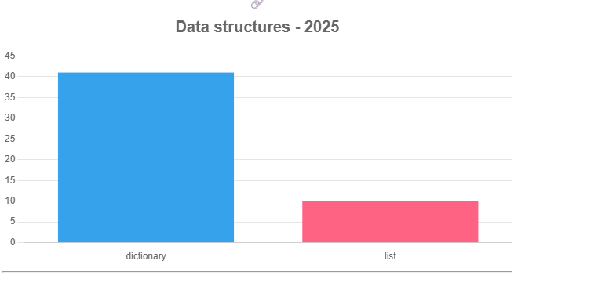

# Explorando evolução de código

Neste exercício, iremos explorar a evolução de código em sistemas reais.

Iremos utilizar a ferramenta [GitEvo](https://github.com/andrehora/gitevo).
Essa ferramenta analisa a evolução de código em repositórios Git nas linguagens Python, JavaScript, TypeScript e Java, e gera relatórios `HTML` como [este](https://andrehora.github.io/gitevo-examples/python/pandas.html).

Mais exemplos de relatórios podem ser podem ser encontrados em [https://github.com/andrehora/gitevo-examples](https://github.com/andrehora/gitevo-examples).

# Passo 1: Selecionar repositório a ser analisado

Selecione um repositório relevante na linguagem de sua preferência (Python, JavaScript, TypeScript ou Java).
Você pode encontrar projetos interessantes nos links abaixo:

* Python: [https://github.com/topics/python?l=python](https://github.com/topics/python?l=python)
* JavaScript: [https://github.com/topics/javascript?l=javascript](https://github.com/topics/javascript?l=javascript)
* TypeScript: [https://github.com/topics/typescript?l=typescript](https://github.com/topics/typescript?l=typescript)
* Java: [https://github.com/topics/java?l=java](https://github.com/topics/java?l=java)

# Passo 2: Instalar e rodar a ferramenta GitEvo

> \[!NOTE]
> Antes de instalar a ferramenta, é recomendado criar e ativar um [ambiente virtual Python](https://packaging.python.org/en/latest/guides/installing-using-pip-and-virtual-environments/#create-and-use-virtual-environments).

Instale a ferramenta [GitEvo](https://github.com/andrehora/gitevo) com o comando:

```bash
$ pip install gitevo
```

Execute a ferramenta no repositório selecionado utilizando o comando abaixo (ajuste conforme a linguagem do repositório).
Substitua `<git_url>` pela URL do repositório que será analisado:

```bash
# Python
$ gitevo -r python <git_url>

# JavaScript
$ gitevo -r javascript <git_url>

# TypeScript
$ gitevo -r typescript <git_url>

# Java
$ gitevo -r java <git_url>
```

Por exemplo, para analisar o projeto Flask escrito em Python:

```bash
$ gitevo -r python https://github.com/pallets/flask
```

> \[!NOTE]
> Essa etapa pode demorar alguns minutos pois o projeto será clonado e analisado localmente.

# Passo 3: Explorar o relatório de evolução de código

Após executar a ferramenta [GitEvo](https://github.com/andrehora/gitevo), é gerado um relatório `HTML` contendo diversos gráficos sobre a evolução do código.

Abra o relatório `HTML` e observe com atenção os gráficos.

# Passo 4: Explicar um gráfico de evolução de código

Selecione um dos gráficos de evolução e explique-o com suas palavras.
Por exemplo, você pode:

* Detalhar a evolução ao longo do tempo
* Detalhar se as curvas estão de acordo com boas práticas
* Explicar grandes alterações nas curvas
* Explorar a documentação do repositório em busca de explicações para grandes alterações
* etc.

Seja criativo!

# Instruções para o exercício

1. Crie um `fork` deste repositório (mais informações sobre forks [aqui](https://docs.github.com/pt/pull-requests/collaborating-with-pull-requests/working-with-forks/fork-a-repo)).
2. Adicione o relatório `HTML` no seu fork.
3. No Moodle, submeta apenas a URL do seu `fork`.

Responda às questões abaixo diretamente neste arquivo `README.md` do seu fork:

---

### 1. Repositório selecionado:

[AI\_triagem](https://github.com/Samai-S/AI_triagem)

### 2. Gráfico selecionado:

**Data structures - 2025**



### 3. Explicação:

O gráfico **“Data structures - 2025”** mostra o uso das principais estruturas de dados do projeto.
Segundo a análise do GitEvo, o repositório contém:

* **41 ocorrências de dicionários**
* **10 ocorrências de listas**

Isso indica que o código utiliza intensivamente **dicionários** para armazenar e manipular informações no formato chave-valor, o que é comum em aplicações Python que lidam com **dados estruturados (como JSON, parâmetros de configuração e registros de triagem de pacientes)**.

O uso relativamente menor de listas sugere que o sistema ainda não lida com grandes coleções sequenciais, mas sim com **registros individuais organizados por atributos**.

Esse padrão está alinhado a boas práticas em Python, pois torna o código mais legível e flexível. Além disso, pode ser um reflexo de que o projeto ainda está em fase inicial (apenas 2 arquivos Python e 248 linhas de código no total).

Um ponto a observar na evolução futura é se o uso de listas crescerá, principalmente se o sistema começar a processar **históricos de triagens ou lotes maiores de dados de entrada**.


